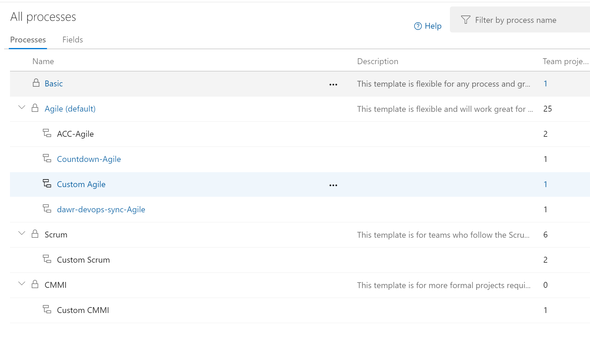
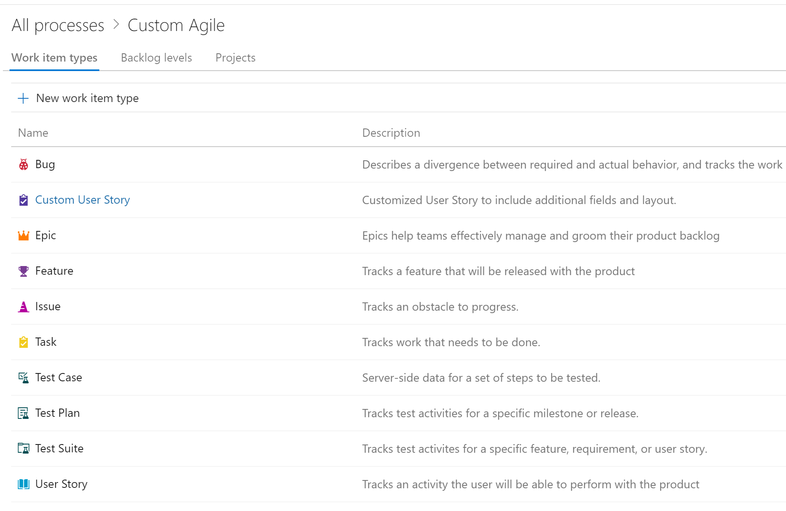
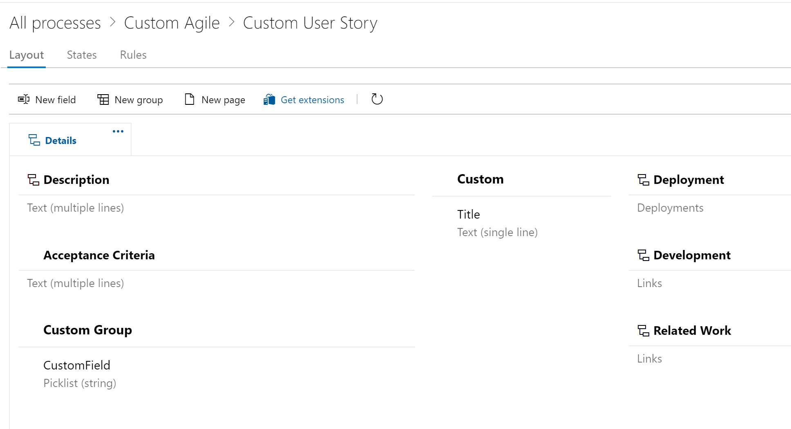

# Azure DevOps Low-Fidelity Migration

## Introduction

The aim of this guide is to provide a path for low-fidelity migration for Azure DevOps.
The scope of this migration guide is Azure DevOps Server (on-premises) to Azure DevOps Services in the cloud. However, some of the steps are applicable to migration between organisations / projects already existing in Azure DevOps Services.

You should try first the widely supported scenario – high-fidelity migration: https://docs.microsoft.com/en-us/azure/devops/migrate/migration-overview?view=azure-devops

However, there may be situations where the high-fidelity approach doesn't work for you:
 -	multiple collections on-prem and requirement to merge them into one
 - legacy projects / data which require too much effort to clean up
 - process improvement which is too difficult to apply in the current state
 - desire to start with a clean inherited process, but bring some data from the previous state
The low-fidelity migration allows different scenarios as well:
 - Azure DevOps Server / TFS -> Azure DevOps Server / TFS
 - Azure DevOps Server / TFS -> Azure DevOps Services
 - Azure DevOps Services -> Azure DevOps Server / TFS
 - Azure DevOps Services -> Azure DevOps Services
The tools evaluated to perform low-fidelity migrations are:
 - nkdagility Azure DevOps migration tool VstsSyncMigrator https://nkdagility.github.io/azure-devops-migration-tools/
 - WiMigrator (maintained by Microsoft) https://github.com/microsoft/vsts-work-item-migrator

We used VstsSyncMigrator for area paths, iterations and teams migration.

We used WiMigrator for work items migration (all WIs, except test plans and test suites).

We created our own PowerShell scripts to migrate test configurations, test plans and test suites, and to associate test cases with test suites, calling Azure DevOps REST API (https://docs.microsoft.com/en-us/rest/api/azure/devops/?view=azure-devops-rest-5.1).

## Pre-requisites:

 - Azure DevOps Server 2019 Update.1 on-premises (can be TFS 2017 Update 2 or later)
 - Azure DevOps Services organisation in the cloud
 - ADFS identities synchronised with the Azure AD tenant
 - download and install nkdagility Sync Migrator: https://nkdagility.github.io/azure-devops-migration-tools/
 - download and install WiMigrator: https://github.com/Microsoft/vsts-work-item-migrator
 - PowerShell v5.1 or later available on the machine performing the migration
 - Collection Administrator permissions on the source
 - Organisation Administrator permissions on the target
Identities

In order to use an Azure DevOps organisation for your enterprise, there is a requirement to synchronise identities from ADFS on premises with Azure AD tenant in the cloud. This is necessary for multiple reasons, such as Visual Studio licencing validation, billing, etc.

However, your users are not automatically added to the organisation, you should perform this step yourself.
One way is to do it manually, using the Organisation settings -> Users page. 
If there are too many users, you can use the scripts provided in the repository.
You can add one user at a time by UPN or in bulk using a CSV file:

``` PowerShell
$upn = '<user email>'
$projectId = '<project guid>'
$accessLevel = 'stakeholder' # basic, stakeholder, subscriber
$destCtx | Add-AzureDevOpsUserProjectEntitlement -upn $upn -accountLicenseType $accessLevel -projectId $projectId
 
$destCtx | Add-AzureDevOpsUsersProjectEntitlement -usersCsvPath .\Users1.csv -accountLicenseType $accessLevel -projectId $projectId
```

## Process Templates

The low-fidelity approach gives you the opportunity to review the process you are using. By reviewing the process before the actual migration, you can eliminate unnecessary custom fields or even custom Work Item Types. However, if you want to migrate all your process templates, additional work is required prior migration.
High-fidelity migration imports the Xml-hosted process templates into the cloud without any opportunity of alteration. You can clone the Xml-hosted process into an inherited one later on, but it should be noted that not all the features are available:
 - global lists are not available in the inherited process
 - you can create picklist fields, but the list values need to be populated from the UI (there are APIs available, but couldn't find an example on how to automate this process)
 - the picklist values cannot be shared between fields, however fields are added at global level and can be reused across different templates / projects / work item types.
 - if your on-prem Xml-template uses custom controls such as the Multivalue control (https://marketplace.visualstudio.com/items?itemName=ms-devlabs.vsts-extensions-multivalue-control), you will need to install the corresponding extension and configure the field manually in your Work Item Type layout.
 
These are the recommended steps to ensure the migration and mapping of the source process template works:
 - create an inherited process based on one of the default ones, preferably Agile or Scrum - this step is necessary to allow potential customisations for migration
 
 
 - identify all custom Work Item Types in your Xml-hosted process template and create them manually in Azure DevOps services
 
 
 - identify all custom fields in your Xml-hosted process template and create the corresponding custom fields in your inherited process - you should keep the list of custom fields, because you will need to map them for work items migration - mapping depends on the tool of choice, but you will need the **field reference name** (for example, if your custom field has the name `<Org>.<Namespace>.<Field>` in the Xml-hosted template, it will be named `Custom.<Field>` in the Azure DevOps Services organisation - note the hard-coded value "Custom")
 - modify the layout of your Work Item Types - the layout can be changed later and luckily the layout editor is pretty easy to use
 
 
## Area Paths

You may want to clean-up the area paths before migration, however you must make sure that there is no work item you want to migrate that is associated with the area paths you want to delete. You can migrate work items pointing to non-existing area paths, however extra work is required post-migration to fix the broken work items.

To import area paths, use the nkdagility Sync Migrator tool. You only need to add and enable a processor of type `NodeStructuresMigrationConfig`  in the configuration file.

Go to [configuration example](./docs/area-paths-iterations.md).

## Iterations

As with area paths, if you want to delete or filter out iteration paths prior migration, make sure that there are no work items associated with those iterations.
To import iterations, use the nkdagility Sync Migrator tool. You only need to add and enable a processor of type NodeStructuresMigrationConfig  in the configuration file.

Go to [configuration example](./docs/area-paths-iterations.md).

## Teams

You can create teams manually or you can import them using the nkdagility Sync Migrator tool.
Please notice that although teams can be migrated using the tool, you'll need to configure them yourself - this includes team membership, general configuration, area paths, iteration paths, backlog default iteration, notifications, etc.

Team configuration can be done post-migration, or during batches, to confirm the migration is correct.

To import teams , use the nkdagility Sync Migrator tool. You only need to add and enable a processor of type `TeamMigrationConfig` in the configuration file.
Go to [configuration example](./docs/teams.md).

## Work Items

The tools are able to migrate all types of work items. You need to be careful with special work items types like Test Plans and Test Suites (Test Cases are migrated, but you will need to perform extra work to associate them with the test suites).

Both tools Sync Migrator and WiMigrator are able to import work items. However, due to various environmental constraints, Sync Migrator was very slow for us, so we used WiMigrator for this step.

Go to the [Vsts Sync Migrator configuration example](./docs/workitems-vsts-sync-migrator.md).

Go to the [WiMigrator configuration example](./docs/workitems-wi-migrator.md).

## Test Plans and Test Suites

Test Plans and Test Suites require additional information as opposed to other Work Item types. 
It's better to exclude the corresponding work items from initial WI migration altogether, as the creation of new Test Plans and Test Suites will create new WIs anyway.

Prior to test plans migration, you will need to perform the Test Configurations migration, as the Test Case association requires one or more configurations.

Test Plans migration is done one plan at a time. These are the steps executed during migration:
 - extract the source test plan
 - map the area path and iteration to the target (that is required if the source project name is different than the target project name)
 - create the target test plan
 - recursively, starting with the root suite, go through all suites and perform the following tasks:
    - get the source test suite
    - create the target test suite:
        - if the test suite is query-based, make sure the destination query is mapped to the source
        - if the test suite is requirements-based, map the requirement ID from source to the requirement ID from target
        - if the test suite is static, associate the target Test Cases based on source Test Cases, making sure the Test Points (configurations) are matching
        
Go to the [configuration example](./docs/test-plans.md).

## Code

To import GIT code repositories, you can use the Azure DevOps Service Import Repository feature, which works for TFS 2017 Update 1 or later, Azure Repos, GitHub, etc.
You can also use the git CLI, by creating a new remote pointing to the target repo. See the following link for more information: https://docs.microsoft.com/en-us/azure/devops/repos/git/move-git-repos-between-team-projects?view=azure-devops
For TFVC to GIT migration, you can use the git-tfs tool: http://git-tfs.com/

## Builds - TBD
## Releases - TBD
## Artifacts - TBD

