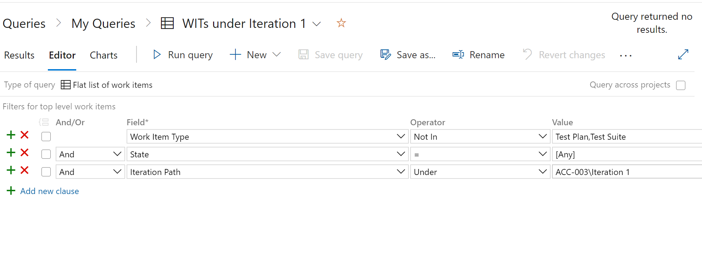

# Work Items Migration

The Microsoft's own [Work Items Migrator](https://github.com/Microsoft/vsts-work-item-migrator) performs Work Items migration based on existing saved queries. You need to specify the query name (and path).

It is recommended to perform migration in batches, to avoid timeouts, throttling etc.
You can apply different batching strategy: area path-based, iteration-based, or a mix between the two. Based on our experience, iteration-based strategy works well, but we had to perform migration of several batches to match program increments used in the program of work. 
Regardless of the strategy selected, you need to make sure there are no links to items outside the strategy criteria, otherwise the work item links will be incomplete.
Execute the following steps:
 - in the target project, create a query which returns all Work Items of the batch you want to migrate
 
 - add the query name (and path) in the configuration file 
``` json
{
  "source-connection": {
    "account": "http://{server}:8080/tfs/{collection}",
    "project": "{source project}",
    "access-token": "",
    "use-integrated-auth": "true"
  },
  "target-connection": {
    "account": "https://dev.azure.com/{org}",
    "project": "{target project}",
    "access-token": "***",
    "use-integrated-auth": "false"
  },
  "query": "My Queries/{batch query}",
  "heartbeat-frequency-in-seconds": 30,
  "query-page-size": 20000,
  "parallelism": 2,
  "max-attachment-size": 62914560,
  "link-parallelism": 2,
  "attachment-upload-chunk-size": 1048576,
  "skip-existing": false,
  "move-history": true,
  "move-history-limit": 200,
  "move-git-links": false,
  "move-attachments": true,
  "move-links": true,
  "source-post-move-tag": "",
  "target-post-move-tag": "{batch tag}",
  "skip-work-items-with-type-missing-fields": false,
  "skip-work-items-with-missing-area-path": false,
  "skip-work-items-with-missing-iteration-path": false,
  "default-area-path": "{source project}",
  "default-iteration-path": "{target project}",
  "clear-identity-display-names": false,
  "ensure-identities": false,
  "include-web-link": true,
  "log-level-for-file": "information",
  "field-replacements": {
    "System.Id": { "field-reference-name": "Custom.ReflectedWorkItemID" },
    "{source field ref name}": { "field-reference-name": "{target field ref name}" },
    ...
  },
  "send-email-notification": false,
  "email-notification": {
    "smtp-server": "127.0.0.1",
    "use-ssl": false,
    "port": "25",
    "from-address": "wimigrator@example.com",
    "user-name": "un",
    "password": "pw",
    "recipient-addresses": [
      "test1@test.com",
      "test2@test.com"
    ]
  }
}
```
 - run the command in the WiMigrator binary folder 
```
dotnet WiMigrator.dll --migrate <path to config file>
```
For information on the configuration settings, visit the following page: https://github.com/microsoft/vsts-work-item-migrator/blob/master/WiMigrator/migration-configuration.md 
WiMigrator has an option to migrate history:
``` json
"move-history": true,
"move-history-limit": 200,
```

Unfortunately, this doesn't set the history on the target item, it only creates a JSON attachment, which may not be that useful.
To overcome this limitation, you can use this script published on *Colin ALM Corner* blog: https://colinsalmcorner.com/bulk-migrate-work-item-comments-links-and-attachments/ 

You can tweak the script to only import comments, as links and attachments are migrated using WiMigrator. This could be a post-migration phase after the Work Items batch migration. The script requires a CSV mapping file which contains both the WI source ID and the WI target ID. To generate this file, you can go into the target project and create a WI query which returns the list of the WI migrate in a batch (the batch migration is recommended for this task as well). The query needs to return the reflected Work Item ID (ther source ID) and the target Work Item ID. You may need to update the CSV header to match the identifier column names in the script (OldId and NewId) 

Migrating comments is slower than migrating WIs, because the task is more complex as it needs to perform the following steps:
 - load CSV mapping file
 - loop through the list and for each map:
    - find the source WI
    - find the target WI
    - get the list of comments from source WI
    - for each comment update the target WI history and save
